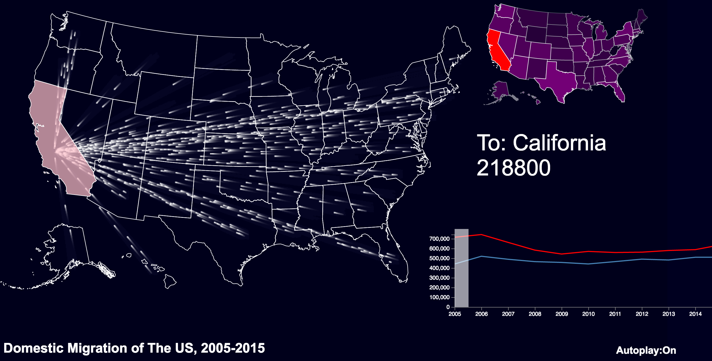
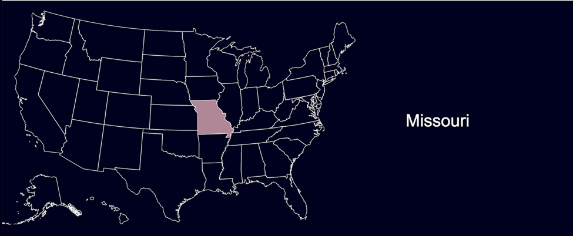
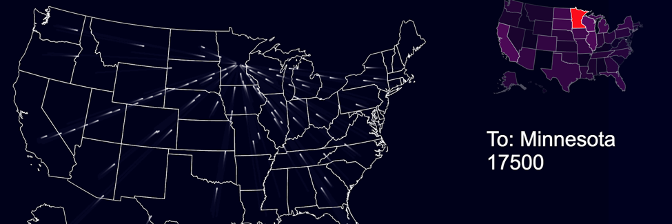
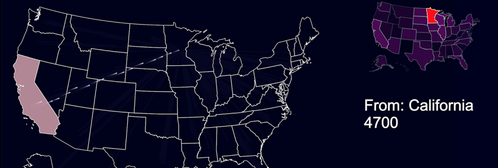
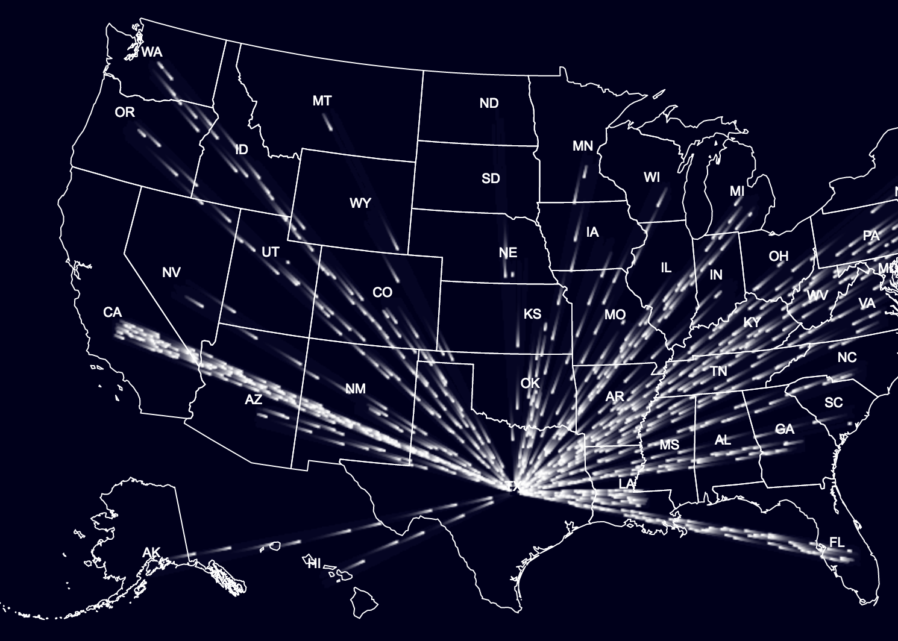
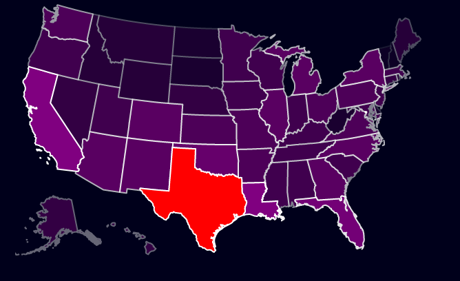
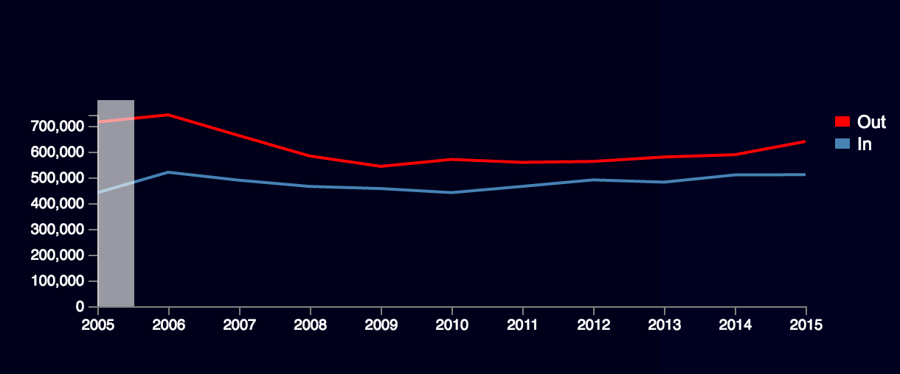

# Population-Migration-of-USA

[This is the link](https://yijiang93.github.io/Population-Migration-of-USA/)

## Data
Our data source is the census of governments, which provides state-to-state and regional migration flows over years.
We download data for 10 years in this website. We cleaned the data in Excel and transformed migration data in a 50 by 50 matrix in a csv file.

## Interactions
In the flow map, we have interactions to help users navigating the data.

1. Hover to inspect a specific state

  Users can hover to a specific state. The chosen state will be highlighted, and the name of the state will be shown to the side.
  
  

2. Click state to start flow

  The flow will start, the minimap will appear, and the information tab will change accordingly(the migration number will change in real time).
  
  

3. Inspect states after flow starts
  
  After the flow to one state starts, you can hover over another state. This action will temporarily make all flow from other states invisible, and shows only the flow from this state.
  
  
 

## Design achievement
We feel like dark blue background + white outlines and texts is quite minimalist and sleek. We also decided to remove the state aberrations on the map, and show the name of selected or hovered state besides the map.

1. Migration part(flowing part)

  

  Each flow has a definition, that it has origin-destination pairing, and the amount of dots in the flow is based on data.
  It is more accurate in terms of geographical fidelity. The origin-destination pairing is not ambiguous and the amount of flow is shown more obviously. We choose white squares with side lengths of 2 as it gives better performance and fits the black background color of US map.

2. A heatmap

  

  On the top right corner is a small heatmap of the US. It shows the general migrating population from other states to the state users selected.

3. A ten-year migration line chart.

  

  There are two lines in the chart, representing out-flow and in-flow respectively. At each timestamp(year) there is a highlighter, click it will change the year to the one shown on the axis, and if a state is selected already, it will start the flow of this year of the selected state.

## Technical achievement

1. Map design

  Our initial design comprises of three layers, with a SVG map as the bottom layer and two canvas elements as the middle and surface layer. The bottom layer is a US state map, the second layer is 50 red dots that are used to label each state and the third layer holds flowing points.

  This design does what we wanted to show in the visualization. But it looks very ungainly and has extremely poor performance. First of all, all interactions are done on the invisible canvas layers. Because canvas doesn’t have data binding features, it is nigh impossible to determine where the mouse is pointing at. Thus we used the red dots for state selection, users need to click on them to inspect this state’s flow. Secondly, we are using a very primal approach to animate the dots, with fill() and clearRect() repeatedly. It hinders the trailing effect that we want to implement in a way that as long as there are more than one dot on the screen, the dots will start blinking and have no visible trails. Additionally, this design is ugly to say the least. The visible dots on the map are eyesores and the background-map contrast is very bad. In order to improve the vis both functionally and ascetically, we overhauled the layers of canvas and SVG.

  In this iteration, we put the canvas layers on bottom, and the SVG on top of them. The SVG layer is completely transparent except for the outlines of the states. And the flow will be generated underneath with no occlusion. This opens the possibility to interact directly with SVG instead of canvas, which means we can use the help of D3 to greatly improve the interactivity and ascetics. Now users can select a state by clicking anywhere in the state, also hovering effects can be introduced. With this change, we can actually improve the performance by getting rid of the “state dots” layer because interacting with this layer is no longer desired.

  The new approach is to invoke the requestAnimationFrame() instead of setInterval(). It tells the browser that you wish to perform an animation and requests that the browser call a specified function to update an animation before the next repaint. The method takes as an argument a callback to be invoked before the repaint. With this method, we finally achieved the visual effects we wanted.

2. Widely adoptted canvas element

  In this project, we don’t adopt svg but canvas as main html element to move points because the canvas element is part of HTML5 and allows for dynamic, scriptable rendering of 2D shapes and bitmap images.

3. Trailing effects

  Adding trailing effect for points gives a cool sense of moving in a certain direction, without which the whole map looks mundane. But realizing trailing effect is not as easy as it looks. Refilling the canvas will erase traces completely, which is against our purpose of keeping parts of traces.

  To address this, we refill the canvas with an opacity of 0.1 at a rate exactly equal to the speed of moving points such that a visible trail is left.

4. Autoplay function

  The flow will continue to next year automatically after last year’s flow finishes. The reason for this is that the US Census website doesn’t provide month-by-month data, and we have to flatten the data, spread it evenly through the year to simulate the monthly movement. And with the autoplay function, we can mimic the passing of time(although not perfectly).
